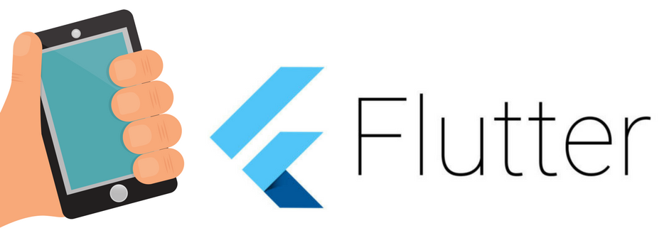

# Flutter-Examples

## Index

### UI Design
| Title | Description | Youtube  |
|---|---|---|
| Login UI | Description will be updated soon | No |
| Register UI | Description will be updated soon | No |
| List view UI | Description will be updated soon | No |

### Some more Useful
| Title | Description | Github  | Youtube  |
|---|---|---|---|
| ListView Builder | Use ListView Builder to dynamically Build List UI. | [Yes](https://gist.github.com/nitishk72/c2a731b8fd9da5d20d2baa1d5d6c9b0f) | [Yes](https://youtu.be/-GMcRq-xoh4) |
| URL Launcher | Launch URL to  open Browser, Phone Dialer, Phone Messaging, E-mail | NO | [Yes](https://youtu.be/6oHaRzBQcrc) |
| Fetech JSON | Fetching JSON from Internet | [Yes](https://github.com/nitishk72/Flutter-Async) | [Yes](https://youtu.be/IZUrUtgIWOQ) |
| JSON to List<T> | Putting JSON Data into List<T> | [Yes](https://github.com/nitishk72/flutter_json_list) | [Yes](https://www.youtube.com/) |
| Dynamic Widget | Create Dynamic Widget and fetch that Widget | [Yes](https://github.com/nitishk72/Flutter_Dynamic_Widget) | [Yes](https://youtu.be/xPW1vtDDlt4/) |
| Image Picker | Pick Image from Camera or Gallery | No | [Yes](https://youtu.be/kNe4Fw3zkKY) |

### Firebase
| Title | Description | Youtube  |
|---|---|---|
| Firebase Auth | Movement and Migration data of animals | No |
| Firebase Realtime Database | Description will be updated soon | No |
| Firebase Cloud Firestore | Description will be updated soon | No |
| Firebase Storage | Description will be updated soon | No |
| Firebase Admob | Description will be updated soon | No | 

### Flutter Packages 

| Title | Description | Youtube  |
|---|---|---|
| Barcode Scan | Description will be updated soon | No | 
| Image Picker | Description will be updated soon | No |
| URL Launcher | Description will be updated soon | No | 

### Created & Maintained By
[Nitish Kumar Singh](https://github.com/nitish72) ([@Official_Nitish](https://www.twitter.com/Ofiicial_Nitish))

> If you found these examples helpful or you learned something from their source code and want to thank me, consider buying me a cup of :coffee:
>  + [PayPal](https://www.paypal.me/nitishk72/5)
>  + Bitcoin Address: 12UUG8KBzL7uXeC4pYEj9Ejj6mzN5ppvzm

License
=======

    Copyright 2017 Nitish Kumar Singh

    Licensed under the Apache License, Version 2.0 (the "License");
    you may not use this file except in compliance with the License.
    You may obtain a copy of the License at

       http://www.apache.org/licenses/LICENSE-2.0

    Unless required by applicable law or agreed to in writing, software
    distributed under the License is distributed on an "AS IS" BASIS,
    WITHOUT WARRANTIES OR CONDITIONS OF ANY KIND, either express or implied.
    See the License for the specific language governing permissions and
    limitations under the License.
